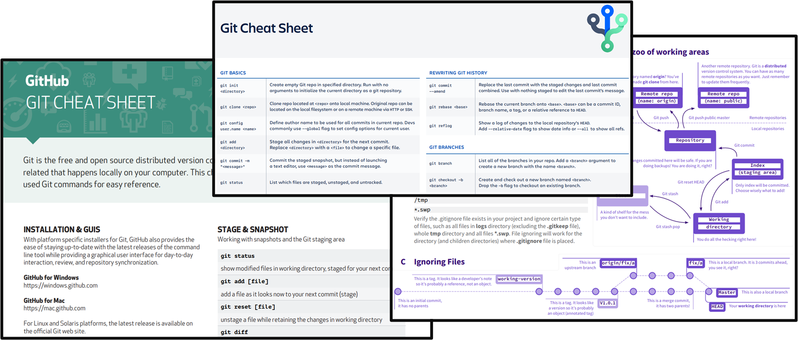

# Additional Resources + Notes
List of accurate resources.

## Tips and Tricks
The cheat sheet features the most important and commonly used Git commands for easy reference.

- [Git Command Explorer](https://gitexplorer.com/): Find the right commands you need without digging through the web.
- [GitHub](https://education.github.com/git-cheat-sheet-education.pdf)
- [GitLab](https://about.gitlab.com/images/press/git-cheat-sheet.pdf)
- [Bitbucket](https://www.atlassian.com/git/tutorials/atlassian-git-cheatsheet)

## Notes

 * [Go to general guide](../guides/general-and-more.md)

## Self-learning
Also, great content:

- What is Git? A Beginner's Guide to Git Version Control [article](https://www.freecodecamp.org/news/what-is-git-learn-git-version-control/)
- Learning git branching [intermediate level](https://learngitbranching.js.org/)
- [Playlist on YouTube](https://youtube.com/playlist?list=PLTd5ehIj0goMCnj6V5NdzSIHBgrIXckGU) in Spanish

## Personalize your markdown file and more
- [Emoji cheat sheet](https://github.com/ikatyang/emoji-cheat-sheet)
- [Shields and Badges](https://github.com/badges/shields)
- [GitHub awesome list](https://github.com/tiimgreen/github-cheat-sheet)
- [.gitignore templates](https://github.com/github/gitignore)

<!-- https://www.w3schools.com/git/git_remote_getstarted.asp -->
<!-- It is a secret. Oswald TC - Oct 14th 2022 -->

[Return to Home](../README.md)
